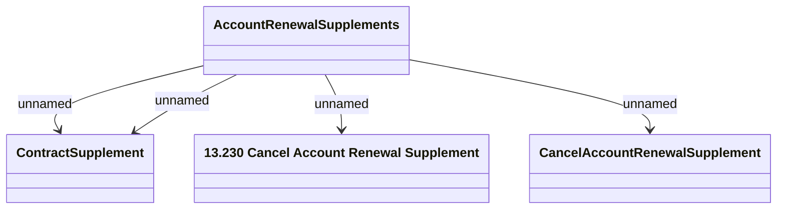

# Cancel Account Renewal Supplement - Web Services

```mermaid
classDiagram
    class n_13_230_Cancel_Account_Renewal_Supplement["13.230 Cancel Account Renewal Supplement"]
    class ContractSupplement["ContractSupplement"]
    class CancelAccountRenewalSupplement["CancelAccountRenewalSupplement"]
    class AccountRenewalSupplements["AccountRenewalSupplements"]
    AccountRenewalSupplements --> ContractSupplement : unnamed
    AccountRenewalSupplements --> n_13_230_Cancel_Account_Renewal_Supplement : unnamed
    AccountRenewalSupplements --> CancelAccountRenewalSupplement : unnamed
    AccountRenewalSupplements --> ContractSupplement : unnamed
```
