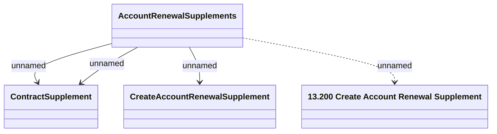

# Create Account Renewal Supplement - Web Services

- **Diagram Type**: Logical
- **Package**: HomerSelect/BSL/Analysis Model/Contract Supplements/REL Account renewal support/Interface Provided/Web Services
- **Diagram ID**: 164406
- **Elements**: 4
- **Connectors**: 4

