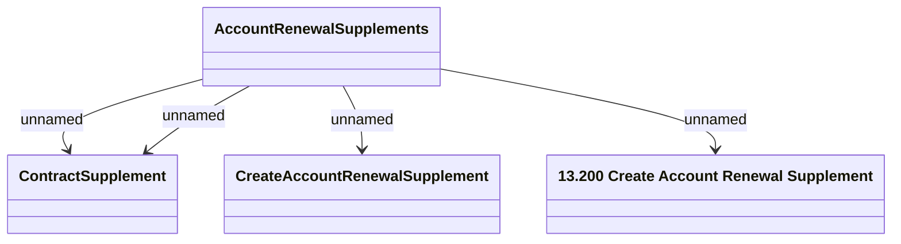

# Create Account Renewal Supplement - Web Services

```mermaid
classDiagram
    class n_13_200_Create_Account_Renewal_Supplement["13.200 Create Account Renewal Supplement"]
    class ContractSupplement["ContractSupplement"]
    class CreateAccountRenewalSupplement["CreateAccountRenewalSupplement"]
    class AccountRenewalSupplements["AccountRenewalSupplements"]
    AccountRenewalSupplements --> ContractSupplement : unnamed
    AccountRenewalSupplements --> CreateAccountRenewalSupplement : unnamed
    AccountRenewalSupplements --> n_13_200_Create_Account_Renewal_Supplement : unnamed
    AccountRenewalSupplements --> ContractSupplement : unnamed
```
