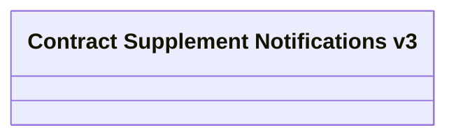

# Generated Messages

- **Diagram Type**: Logical
- **Package**: HomerSelect/BSL/Analysis Model/Contract Supplements/Transaction Supplement support/Interface Provided/Generated Messages
- **Diagram ID**: 152881
- **Elements**: 1
- **Connectors**: 0

