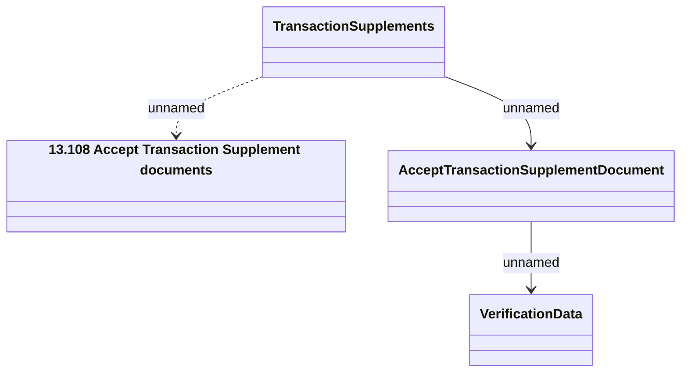

# Transaction Supplement - Accept Transaction Supplement document

- **Diagram Type**: Logical
- **Package**: HomerSelect/BSL/Analysis Model/Contract Supplements/Transaction Supplement support/Interface Provided/Web Services/TransactionSupplements/TransactionSupplements_v1
- **Diagram ID**: 152459
- **Elements**: 4
- **Connectors**: 3

