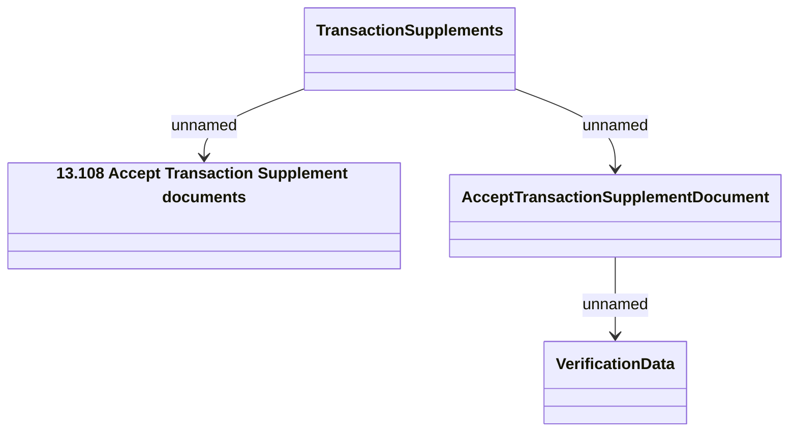

# Transaction Supplement - Accept Transaction Supplement document

```mermaid
classDiagram
    class VerificationData["VerificationData"]
    class n_13_108_Accept_Transaction_Supplement_documents["13.108 Accept Transaction Supplement documents"]
    class AcceptTransactionSupplementDocument["AcceptTransactionSupplementDocument"]
    class TransactionSupplements["TransactionSupplements"]
    TransactionSupplements --> n_13_108_Accept_Transaction_Supplement_documents : unnamed
    TransactionSupplements --> AcceptTransactionSupplementDocument : unnamed
    AcceptTransactionSupplementDocument --> VerificationData : unnamed
```
