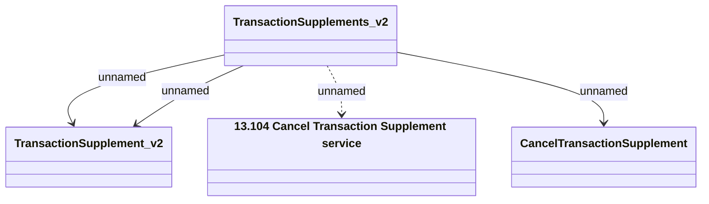

# Transaction Supplement - Cancel Transaction Supplement v2

- **Diagram Type**: Logical
- **Package**: HomerSelect/BSL/Analysis Model/Contract Supplements/Transaction Supplement support/Interface Provided/Web Services/TransactionSupplements/TransactionSupplements_v2
- **Diagram ID**: 152889
- **Elements**: 4
- **Connectors**: 4

