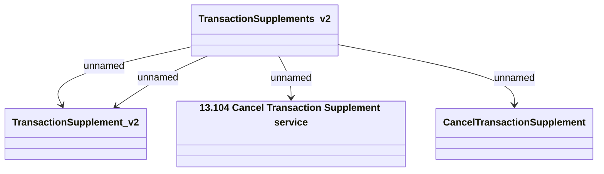

# Transaction Supplement - Cancel Transaction Supplement v2

```mermaid
classDiagram
    class CancelTransactionSupplement["CancelTransactionSupplement"]
    class n_13_104_Cancel_Transaction_Supplement_service["13.104 Cancel Transaction Supplement service"]
    class TransactionSupplement_v2["TransactionSupplement_v2"]
    class TransactionSupplements_v2["TransactionSupplements_v2"]
    TransactionSupplements_v2 --> TransactionSupplement_v2 : unnamed
    TransactionSupplements_v2 --> TransactionSupplement_v2 : unnamed
    TransactionSupplements_v2 --> n_13_104_Cancel_Transaction_Supplement_service : unnamed
    TransactionSupplements_v2 --> CancelTransactionSupplement : unnamed
```
