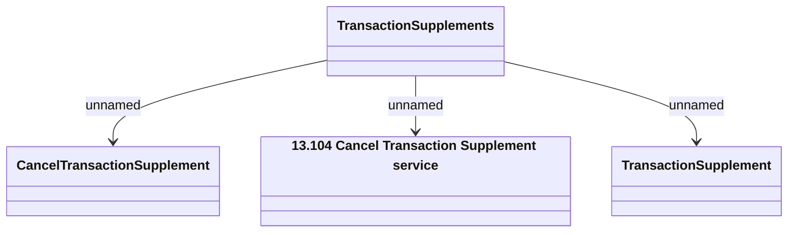

# Transaction Supplement - Cancel Transaction Supplement

```mermaid
classDiagram
    class TransactionSupplement["TransactionSupplement"]
    class CancelTransactionSupplement["CancelTransactionSupplement"]
    class n_13_104_Cancel_Transaction_Supplement_service["13.104 Cancel Transaction Supplement service"]
    class TransactionSupplements["TransactionSupplements"]
    TransactionSupplements --> CancelTransactionSupplement : unnamed
    TransactionSupplements --> n_13_104_Cancel_Transaction_Supplement_service : unnamed
    TransactionSupplements --> TransactionSupplement : unnamed
```
