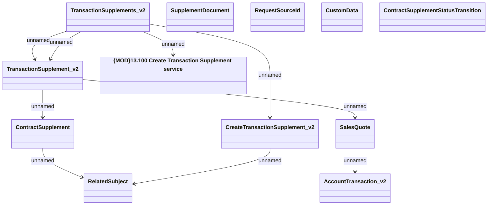

# Transaction Supplement - Create Transaction Supplement v2

```mermaid
classDiagram
    class TransactionSupplements_v2["TransactionSupplements_v2"]
    class AccountTransaction_v2["AccountTransaction_v2"]
    class CreateTransactionSupplement_v2["CreateTransactionSupplement_v2"]
    class SalesQuote["SalesQuote"]
    class TransactionSupplement_v2["TransactionSupplement_v2"]
    class RelatedSubject["RelatedSubject"]
    class ContractSupplement["ContractSupplement"]
    class MOD_13_100_Create_Transaction_Supplement_service["{MOD}13.100 Create Transaction Supplement service"]
    class SupplementDocument["SupplementDocument"]
    class RequestSourceId["RequestSourceId"]
    class CustomData["CustomData"]
    class ContractSupplementStatusTransition["ContractSupplementStatusTransition"]
    TransactionSupplements_v2 --> MOD_13_100_Create_Transaction_Supplement_service : unnamed
    TransactionSupplements_v2 --> TransactionSupplement_v2 : unnamed
    TransactionSupplements_v2 --> TransactionSupplement_v2 : unnamed
    TransactionSupplements_v2 --> CreateTransactionSupplement_v2 : unnamed
    ContractSupplement --> RelatedSubject : unnamed
    TransactionSupplement_v2 --> ContractSupplement : unnamed
    CreateTransactionSupplement_v2 --> RelatedSubject : unnamed
    SalesQuote --> AccountTransaction_v2 : unnamed
    TransactionSupplement_v2 --> SalesQuote : unnamed
```
