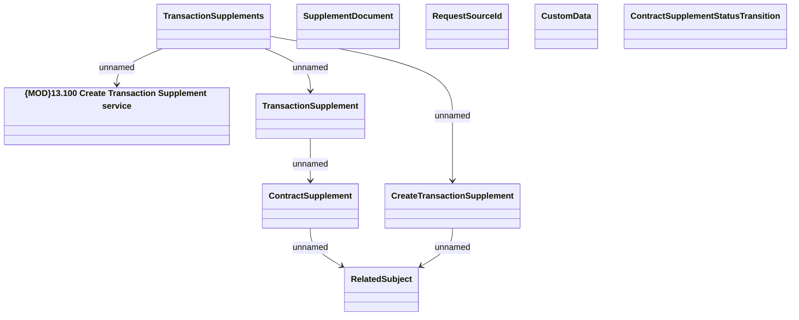

# Transaction Supplement - Create Transaction Supplement

```mermaid
classDiagram
    class RelatedSubject["RelatedSubject"]
    class ContractSupplement["ContractSupplement"]
    class MOD_13_100_Create_Transaction_Supplement_service["{MOD}13.100 Create Transaction Supplement service"]
    class TransactionSupplement["TransactionSupplement"]
    class CreateTransactionSupplement["CreateTransactionSupplement"]
    class TransactionSupplements["TransactionSupplements"]
    class RelatedSubject["RelatedSubject"]
    class SupplementDocument["SupplementDocument"]
    class RequestSourceId["RequestSourceId"]
    class CustomData["CustomData"]
    class ContractSupplementStatusTransition["ContractSupplementStatusTransition"]
    TransactionSupplements --> MOD_13_100_Create_Transaction_Supplement_service : unnamed
    TransactionSupplements --> CreateTransactionSupplement : unnamed
    TransactionSupplements --> TransactionSupplement : unnamed
    ContractSupplement --> RelatedSubject : unnamed
    TransactionSupplement --> ContractSupplement : unnamed
    CreateTransactionSupplement --> RelatedSubject : unnamed
```
