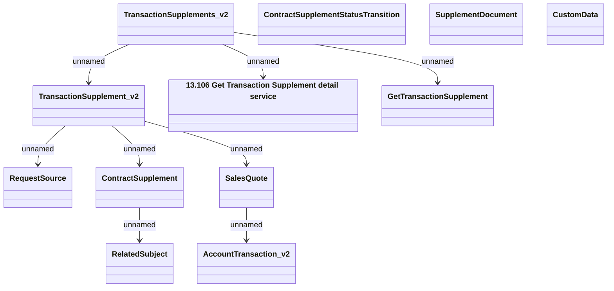

# Transaction Supplement - Get Transaction Supplement v2

```mermaid
classDiagram
    class RequestSource["RequestSource"]
    class AccountTransaction_v2["AccountTransaction_v2"]
    class SalesQuote["SalesQuote"]
    class RelatedSubject["RelatedSubject"]
    class ContractSupplement["ContractSupplement"]
    class TransactionSupplement_v2["TransactionSupplement_v2"]
    class n_13_106_Get_Transaction_Supplement_detail_service["13.106 Get Transaction Supplement detail service"]
    class GetTransactionSupplement["GetTransactionSupplement"]
    class TransactionSupplements_v2["TransactionSupplements_v2"]
    class ContractSupplementStatusTransition["ContractSupplementStatusTransition"]
    class SupplementDocument["SupplementDocument"]
    class CustomData["CustomData"]
    TransactionSupplements_v2 --> GetTransactionSupplement : unnamed
    TransactionSupplements_v2 --> n_13_106_Get_Transaction_Supplement_detail_service : unnamed
    TransactionSupplements_v2 --> TransactionSupplement_v2 : unnamed
    ContractSupplement --> RelatedSubject : unnamed
    TransactionSupplement_v2 --> ContractSupplement : unnamed
    SalesQuote --> AccountTransaction_v2 : unnamed
    TransactionSupplement_v2 --> SalesQuote : unnamed
    TransactionSupplement_v2 --> RequestSource : unnamed
```
