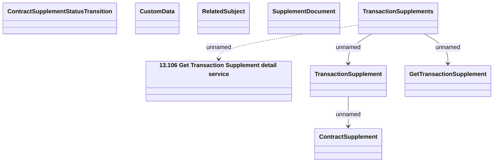

# Transaction Supplement - Get Transaction Supplement

- **Diagram Type**: Logical
- **Package**: HomerSelect/BSL/Analysis Model/Contract Supplements/Transaction Supplement support/Interface Provided/Web Services/TransactionSupplements/TransactionSupplements_v1
- **Diagram ID**: 152460
- **Elements**: 9
- **Connectors**: 4

