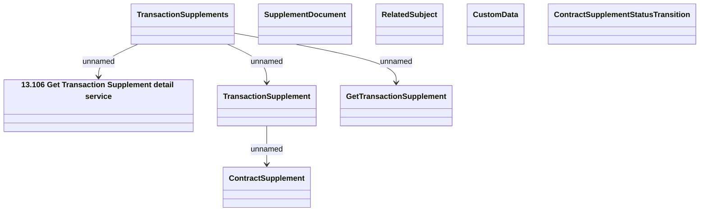

# Transaction Supplement - Get Transaction Supplement

```mermaid
classDiagram
    class n_13_106_Get_Transaction_Supplement_detail_service["13.106 Get Transaction Supplement detail service"]
    class ContractSupplement["ContractSupplement"]
    class TransactionSupplement["TransactionSupplement"]
    class GetTransactionSupplement["GetTransactionSupplement"]
    class TransactionSupplements["TransactionSupplements"]
    class SupplementDocument["SupplementDocument"]
    class RelatedSubject["RelatedSubject"]
    class CustomData["CustomData"]
    class ContractSupplementStatusTransition["ContractSupplementStatusTransition"]
    TransactionSupplements --> GetTransactionSupplement : unnamed
    TransactionSupplements --> n_13_106_Get_Transaction_Supplement_detail_service : unnamed
    TransactionSupplements --> TransactionSupplement : unnamed
    TransactionSupplement --> ContractSupplement : unnamed
```
