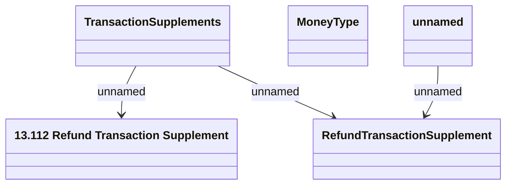

# Transaction Supplement - Update Transaction Supplement

```mermaid
classDiagram
    class RefundTransactionSupplement["RefundTransactionSupplement"]
    class n_13_112_Refund_Transaction_Supplement["13.112 Refund Transaction Supplement"]
    class TransactionSupplements["TransactionSupplements"]
    class MoneyType["MoneyType"]
    unnamed --> RefundTransactionSupplement : unnamed
    TransactionSupplements --> n_13_112_Refund_Transaction_Supplement : unnamed
    TransactionSupplements --> RefundTransactionSupplement : unnamed
```
