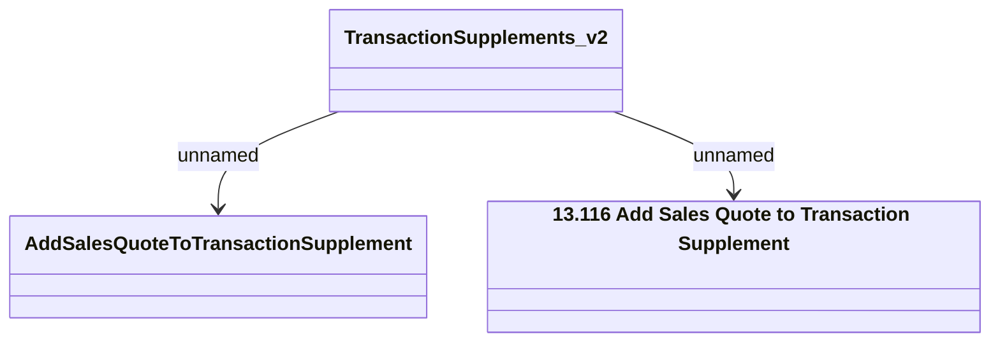

# TransactionSupplements - Add Sales Quote to Transaction Supplement

```mermaid
classDiagram
    class TransactionSupplements_v2["TransactionSupplements_v2"]
    class n_13_116_Add_Sales_Quote_to_Transaction_Supplement["13.116 Add Sales Quote to Transaction Supplement"]
    class AddSalesQuoteToTransactionSupplement["AddSalesQuoteToTransactionSupplement"]
    TransactionSupplements_v2 --> AddSalesQuoteToTransactionSupplement : unnamed
    TransactionSupplements_v2 --> n_13_116_Add_Sales_Quote_to_Transaction_Supplement : unnamed
```
