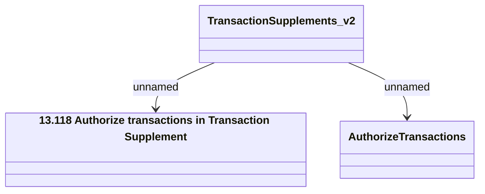

# TransactionSupplements - Authorize transactions in Transaction Supplement

```mermaid
classDiagram
    class TransactionSupplements_v2["TransactionSupplements_v2"]
    class AuthorizeTransactions["AuthorizeTransactions"]
    class n_13_118_Authorize_transactions_in_Transaction_Supplement["13.118 Authorize transactions in Transaction Supplement"]
    TransactionSupplements_v2 --> n_13_118_Authorize_transactions_in_Transaction_Supplement : unnamed
    TransactionSupplements_v2 --> AuthorizeTransactions : unnamed
```
