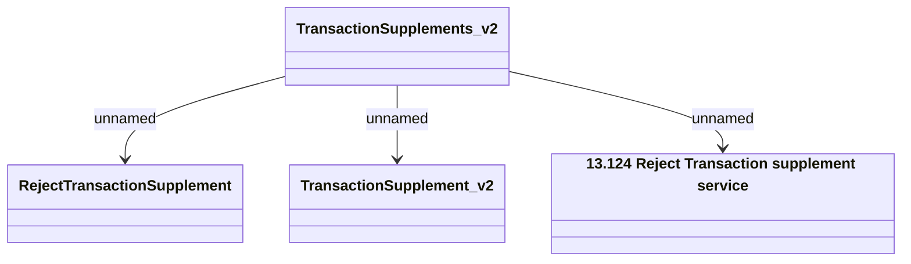

# TransactionSupplements - Reject Transaction Suplement v2

```mermaid
classDiagram
    class n_13_124_Reject_Transaction_supplement_service["13.124 Reject Transaction supplement service"]
    class TransactionSupplement_v2["TransactionSupplement_v2"]
    class RejectTransactionSupplement["RejectTransactionSupplement"]
    class TransactionSupplements_v2["TransactionSupplements_v2"]
    TransactionSupplements_v2 --> RejectTransactionSupplement : unnamed
    TransactionSupplements_v2 --> TransactionSupplement_v2 : unnamed
    TransactionSupplements_v2 --> n_13_124_Reject_Transaction_supplement_service : unnamed
```
