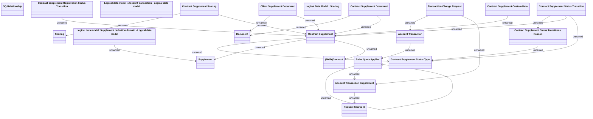

# Transaction Supplement domain - Logical data model

```mermaid
classDiagram
    class SQ_Relationship["SQ Relationship"]
    class Sales_Quote_Applied["Sales Quote Applied"]
    class Transaction_Change_Request["Transaction Change Request"]
    class Logical_data_model_Account_transaction_Logical_data_model["Logical data model : Account transaction - Logical data model"]
    class Request_Source_Id["Request Source Id"]
    class Account_Transaction["Account Transaction"]
    class Account_Transaction_Supplement["Account Transaction Supplement"]
    class Logical_data_model_Supplement_definition_domain_Logical_data["Logical data model :Supplement definition domain - Logical data model"]
    class Scoring["Scoring"]
    class Supplement["Supplement"]
    class Document["Document"]
    class MOD_Contract["{MOD}Contract"]
    class Contract_Supplement_Custom_Data["Contract Supplement Custom Data"]
    class Contract_Supplement_Scoring["Contract Supplement Scoring"]
    class Contract_Supplement_Status_Transitions_Reason["Contract Supplement Status Transitions Reason"]
    class Contract_Supplement["Contract Supplement"]
    class Logical_Data_Model_Scoring["Logical Data Model : Scoring"]
    class Contract_Supplement_Status_Transition["Contract Supplement Status Transition"]
    class Client_Supplement_Document["Client Supplement Document"]
    class Contract_Supplement_Status_Type["Contract Supplement Status Type"]
    class Contract_Supplement_Document["Contract Supplement Document"]
    class Contract_Supplement_Registration_Status_Transition["Contract Supplement Registration Status Transition"]
    Sales_Quote_Applied --> Sales_Quote_Applied : unnamed
    Account_Transaction_Supplement --> Request_Source_Id : unnamed
    Transaction_Change_Request --> Account_Transaction : unnamed
    Transaction_Change_Request --> Account_Transaction_Supplement : unnamed
    Sales_Quote_Applied --> Account_Transaction_Supplement : unnamed
    Account_Transaction --> Sales_Quote_Applied : unnamed
    Logical_data_model_Supplement_definition_domain_Logical_data --> Supplement : unnamed
    Contract_Supplement_Status_Transition --> Contract_Supplement_Status_Transitions_Reason : unnamed
    Contract_Supplement_Status_Transitions_Reason --> Contract_Supplement_Status_Type : unnamed
    Contract_Supplement_Registration_Status_Transition --> Contract_Supplement : unnamed
    Contract_Supplement --> Contract_Supplement_Status_Type : unnamed
    Contract_Supplement_Document --> Document : unnamed
    Contract_Supplement_Status_Transition --> Contract_Supplement : unnamed
    Contract_Supplement_Scoring --> Scoring : unnamed
    Contract_Supplement_Custom_Data --> Contract_Supplement : unnamed
    Client_Supplement_Document --> Document : unnamed
    Client_Supplement_Document --> Contract_Supplement : unnamed
    Contract_Supplement_Status_Transition --> Contract_Supplement_Status_Type : unnamed
    Contract_Supplement_Document --> Contract_Supplement : unnamed
    Contract_Supplement_Scoring --> Contract_Supplement : unnamed
    Contract_Supplement --> Supplement : unnamed
    Contract_Supplement --> MOD_Contract : unnamed
```
