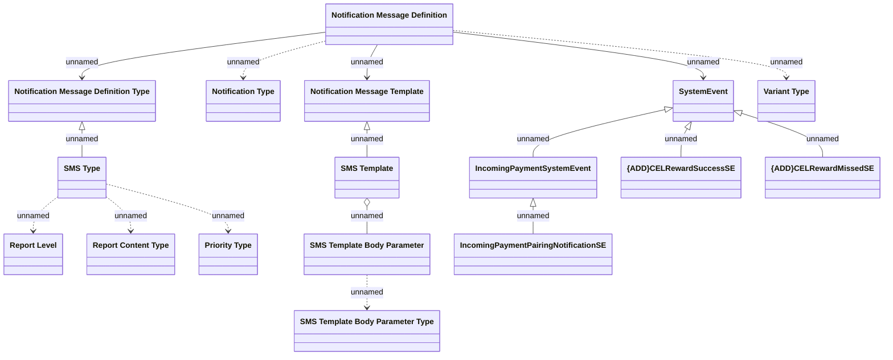

# Logical Data Model

- **Diagram Type**: Logical
- **Package**: HomerSelect/BSL/Analysis Model/Installment Schedule/COMMON for Installment Schedule/Client notifications/Logical Data Model
- **Diagram ID**: 113518
- **Elements**: 17
- **Connectors**: 16

