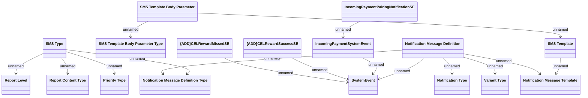

# Logical Data Model

```mermaid
classDiagram
    class ADD_CELRewardSuccessSE["{ADD}CELRewardSuccessSE"]
    class IncomingPaymentPairingNotificationSE["IncomingPaymentPairingNotificationSE"]
    class Priority_Type["Priority Type"]
    class Report_Level["Report Level"]
    class Report_Content_Type["Report Content Type"]
    class SMS_Template_Body_Parameter_Type["SMS Template Body Parameter Type"]
    class SMS_Template_Body_Parameter["SMS Template Body Parameter"]
    class SMS_Type["SMS Type"]
    class Notification_Message_Definition_Type["Notification Message Definition Type"]
    class Variant_Type["Variant Type"]
    class Notification_Type["Notification Type"]
    class IncomingPaymentSystemEvent["IncomingPaymentSystemEvent"]
    class Notification_Message_Template["Notification Message Template"]
    class Notification_Message_Definition["Notification Message Definition"]
    class ADD_CELRewardMissedSE["{ADD}CELRewardMissedSE"]
    class SystemEvent["SystemEvent"]
    class SMS_Template["SMS Template"]
    IncomingPaymentPairingNotificationSE --> IncomingPaymentSystemEvent : unnamed
    SMS_Type --> Report_Level : unnamed
    SMS_Type --> Report_Content_Type : unnamed
    SMS_Template_Body_Parameter --> SMS_Template_Body_Parameter_Type : unnamed
    SMS_Type --> Notification_Message_Definition_Type : unnamed
    Notification_Message_Definition --> Notification_Message_Definition_Type : unnamed
    SMS_Type --> Priority_Type : unnamed
    Notification_Message_Definition --> Notification_Type : unnamed
    SMS_Template_Body_Parameter --> SMS_Template : unnamed
    SMS_Template --> Notification_Message_Template : unnamed
    Notification_Message_Definition --> Notification_Message_Template : unnamed
    Notification_Message_Definition --> SystemEvent : unnamed
    IncomingPaymentSystemEvent --> SystemEvent : unnamed
    Notification_Message_Definition --> Variant_Type : unnamed
    ADD_CELRewardSuccessSE --> SystemEvent : unnamed
    ADD_CELRewardMissedSE --> SystemEvent : unnamed
```
