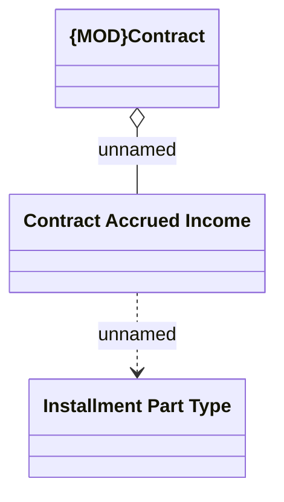

# Contract accrued income domain model

- **Diagram Type**: Logical
- **Package**: HomerSelect/BSL/Analysis Model/Installment Schedule/COMMON for Installment Schedule/Logical Data Model
- **Diagram ID**: 162147
- **Elements**: 3
- **Connectors**: 2

