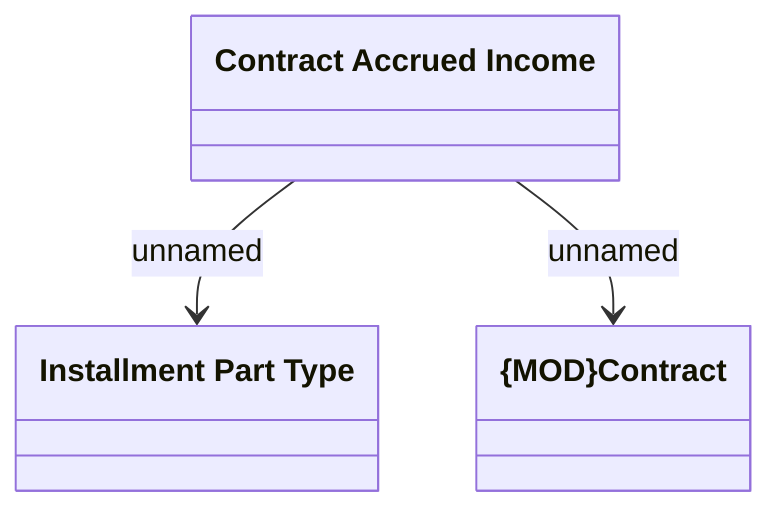

# Contract accrued income domain model

```mermaid
classDiagram
    class Installment_Part_Type["Installment Part Type"]
    class Contract_Accrued_Income["Contract Accrued Income"]
    class MOD_Contract["{MOD}Contract"]
    Contract_Accrued_Income --> Installment_Part_Type : unnamed
    Contract_Accrued_Income --> MOD_Contract : unnamed
```
