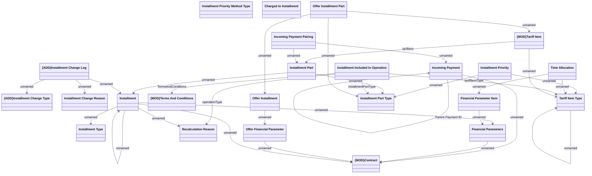

# Installment Schedule

```mermaid
classDiagram
    class ADD_Installment_Change_Type["{ADD}Installment Change Type"]
    class ADD_Installment_Change_Log["{ADD}Installment Change Log"]
    class Installment_Change_Reason["Installment Change Reason "]
    class Installment_Priority_Method_Type["Installment Priority Method Type"]
    class Installment_Type["Installment Type"]
    class Charged_to_Installment["Charged to Installment"]
    class Financial_Parameter_Item["Financial Parameter Item"]
    class Offer_Financial_Parameter["Offer Financial Parameter"]
    class Installment_Included_In_Operation["Installment Included In Operation"]
    class Incoming_Payment_Pairing["Incoming Payment Pairing"]
    class MOD_Terms_And_Conditions["{MOD}Terms And Conditions"]
    class Financial_Parameters["Financial Parameters"]
    class Recalculation_Reason["Recalculation Reason"]
    class Offer_Installment_Part["Offer Installment Part"]
    class Offer_Installment["Offer Installment"]
    class Installment["Installment"]
    class Installment_Priority["Installment Priority"]
    class MOD_Contract["{MOD}Contract"]
    class Time_Allocation["Time Allocation"]
    class Tariff_Item_Type["Tariff Item Type"]
    class MOD_Tariff_Item["{MOD}Tariff Item"]
    class Installment_Part_Type["Installment Part Type"]
    class Incoming_Payment["Incoming Payment"]
    class Installment_Part["Installment Part"]
    ADD_Installment_Change_Log --> ADD_Installment_Change_Type : unnamed
    Installment_Part --> Installment : unnamed
    ADD_Installment_Change_Log --> Installment : unnamed
    Installment --> Installment : unnamed
    Installment_Included_In_Operation --> Recalculation_Reason : operationType
    Installment --> Financial_Parameters : unnamed
    Installment_Included_In_Operation --> MOD_Terms_And_Conditions : TermsAndConditions
    Installment --> Installment_Type : unnamed
    ADD_Installment_Change_Log --> Installment_Change_Reason : unnamed
    Installment --> Recalculation_Reason : unnamed
    Installment_Priority --> Installment_Part_Type : unnamed
    Installment_Part --> Installment_Part_Type : unnamed
    Installment_Priority --> Tariff_Item_Type : unnamed
    Time_Allocation --> Tariff_Item_Type : unnamed
    Installment_Included_In_Operation --> Tariff_Item_Type : tariffItemType
    Installment_Included_In_Operation --> Installment_Part_Type : installmentPartType
    Tariff_Item_Type --> Tariff_Item_Type : unnamed
    MOD_Tariff_Item --> Tariff_Item_Type : unnamed
    MOD_Tariff_Item --> Installment_Part : tarifItem
    Incoming_Payment_Pairing --> Incoming_Payment : unnamed
    Incoming_Payment_Pairing --> Installment_Part : unnamed
    Incoming_Payment --> MOD_Contract : unnamed
    Incoming_Payment --> Incoming_Payment : Original payment ID
    Incoming_Payment --> Incoming_Payment : Parent Payment ID
    Financial_Parameters --> MOD_Contract : unnamed
    Financial_Parameter_Item --> Financial_Parameters : unnamed
    Offer_Installment_Part --> Installment_Part_Type : unnamed
    Offer_Installment_Part --> Offer_Installment : unnamed
    Offer_Installment_Part --> MOD_Tariff_Item : unnamed
    Offer_Installment --> Offer_Financial_Parameter : unnamed
    Offer_Financial_Parameter --> MOD_Contract : unnamed
    Time_Allocation --> Financial_Parameter_Item : unnamed
    Installment --> MOD_Contract : unnamed
```
