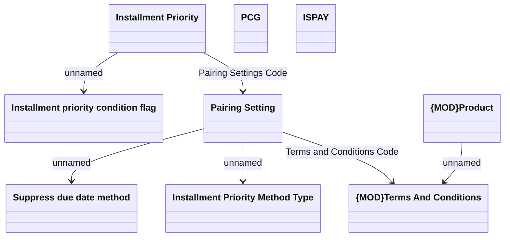

# Pairing priority

```mermaid
classDiagram
    class Suppress_due_date_method["Suppress due date method"]
    class Installment_priority_condition_flag["Installment priority condition flag"]
    class Pairing_Setting["Pairing Setting"]
    class Installment_Priority_Method_Type["Installment Priority Method Type"]
    class MOD_Terms_And_Conditions["{MOD}Terms And Conditions"]
    class Installment_Priority["Installment Priority"]
    class MOD_Product["{MOD}Product"]
    class PCG["PCG"]
    class ISPAY["ISPAY"]
    Pairing_Setting --> MOD_Terms_And_Conditions : Terms and Conditions Code
    Pairing_Setting --> Installment_Priority_Method_Type : unnamed
    Installment_Priority --> Pairing_Setting : Pairing Settings Code
    Installment_Priority --> Installment_priority_condition_flag : unnamed
    Pairing_Setting --> Suppress_due_date_method : unnamed
    MOD_Product --> MOD_Terms_And_Conditions : unnamed
```
