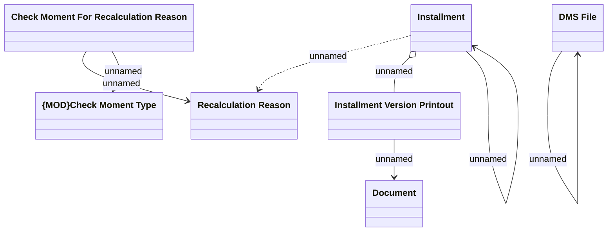

# Printing an Installment schedule

- **Diagram Type**: Logical
- **Package**: HomerSelect/BSL/Analysis Model/Installment Schedule/COMMON for Installment Schedule/Logical Data Model
- **Diagram ID**: 162148
- **Elements**: 7
- **Connectors**: 7

