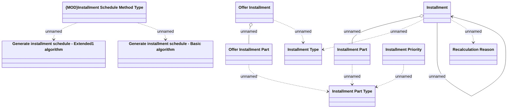

# Types

- **Diagram Type**: Logical
- **Package**: HomerSelect/BSL/Analysis Model/Installment Schedule/COMMON for Installment Schedule/Logical Data Model/Enums&Types
- **Diagram ID**: 159634
- **Elements**: 12
- **Connectors**: 11

