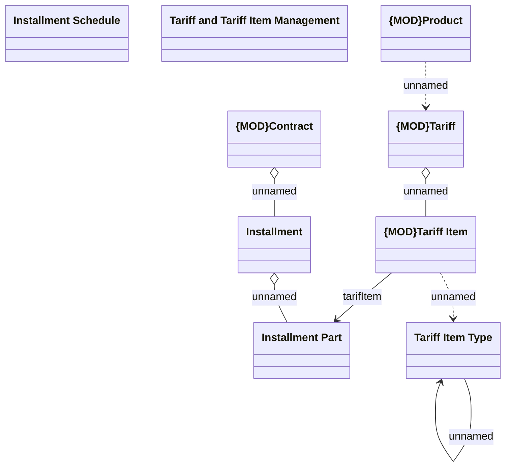

# Fees and Penalties in context

- **Diagram Type**: Logical
- **Package**: HomerSelect/BSL/Analysis Model/Installment Schedule/Fees and Penalties/COMMON for Fees and Penalties/Logical Data Model
- **Diagram ID**: 159976
- **Elements**: 9
- **Connectors**: 7

