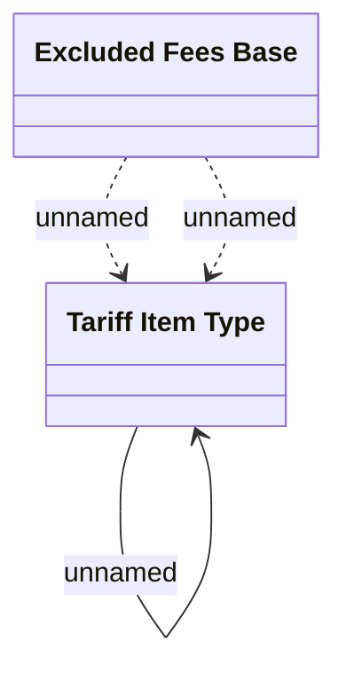

# Fees excluded from percentage base calculation

- **Diagram Type**: Logical
- **Package**: HomerSelect/BSL/Analysis Model/Installment Schedule/Fees and Penalties/COMMON for Fees and Penalties/Logical Data Model
- **Diagram ID**: 159977
- **Elements**: 2
- **Connectors**: 3

