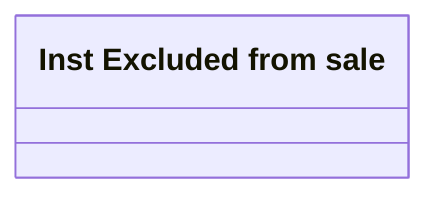

# Inst excluded from sale - Domain model

- **Diagram Type**: Logical
- **Package**: HomerSelect/BSL/Analysis Model/Installment Schedule/Fees and Penalties/Cancel fees for contract sale/Logical Data Model
- **Diagram ID**: 159974
- **Elements**: 1
- **Connectors**: 0

