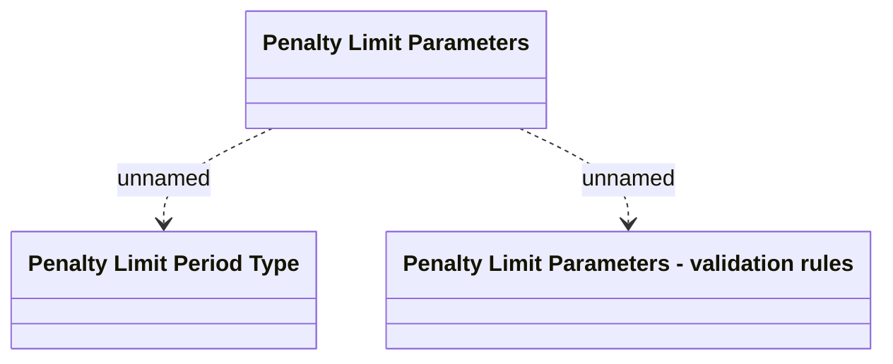

# Penalties Limit Parameters

- **Diagram Type**: Logical
- **Package**: HomerSelect/BSL/Analysis Model/Installment Schedule/Fees and Penalties/Penalty Limit/Logical Data Model
- **Diagram ID**: 159981
- **Elements**: 3
- **Connectors**: 2

