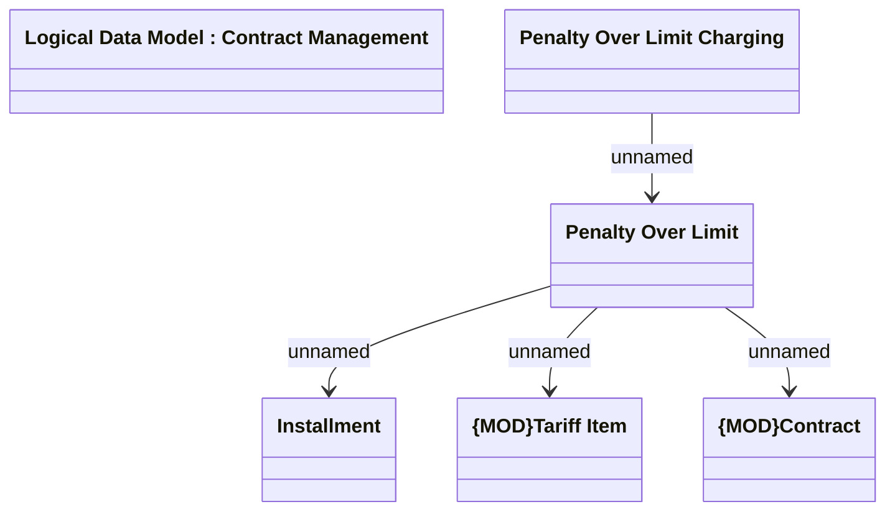

# Penalty Over Limit

```mermaid
classDiagram
    class Logical_Data_Model_Contract_Management["Logical Data Model : Contract Management"]
    class MOD_Tariff_Item["{MOD}Tariff Item"]
    class Installment["Installment"]
    class Penalty_Over_Limit_Charging["Penalty Over Limit Charging"]
    class Penalty_Over_Limit["Penalty Over Limit"]
    class MOD_Contract["{MOD}Contract"]
    Penalty_Over_Limit_Charging --> Penalty_Over_Limit : unnamed
    Penalty_Over_Limit --> Installment : unnamed
    Penalty_Over_Limit --> MOD_Tariff_Item : unnamed
    Penalty_Over_Limit --> MOD_Contract : unnamed
```
