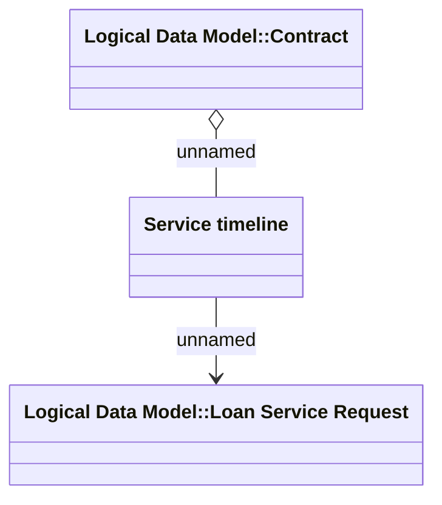

# Service timeline - Domain model

- **Diagram Type**: Logical
- **Package**: HomerSelect/BSL/Analysis Model/Installment Schedule/Service timeline/Logical Data Model
- **Diagram ID**: 137632
- **Elements**: 3
- **Connectors**: 2

