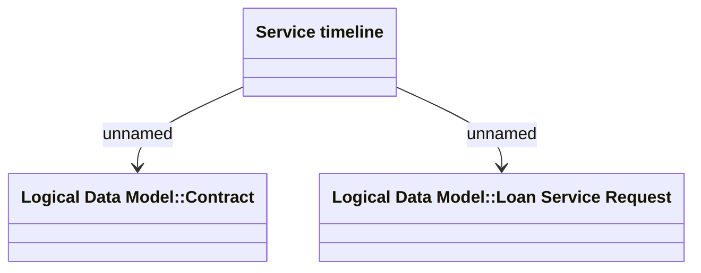

# Service timeline - Domain model

```mermaid
classDiagram
    class Logical_Data_Model_Loan_Service_Request["Logical Data Model::Loan Service Request"]
    class Logical_Data_Model_Contract["Logical Data Model::Contract"]
    class Service_timeline["Service timeline"]
    Service_timeline --> Logical_Data_Model_Contract : unnamed
    Service_timeline --> Logical_Data_Model_Loan_Service_Request : unnamed
```
