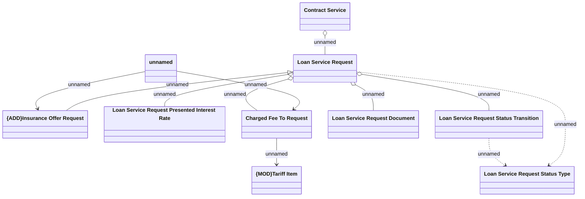

# LSR.Insurance Offer - Logical Data Model

- **Diagram Type**: Logical
- **Package**: HomerSelect/BSL/Analysis Model/Insurance/Insurance Contract/Adding Insurance on running contract/Logical Data Model
- **Diagram ID**: 164177
- **Elements**: 11
- **Connectors**: 11

