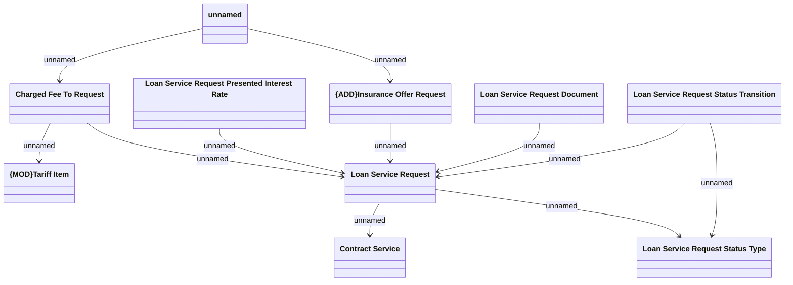

# LSR.Insurance Offer - Logical Data Model

```mermaid
classDiagram
    class ADD_Insurance_Offer_Request["{ADD}Insurance Offer Request"]
    class Loan_Service_Request_Presented_Interest_Rate["Loan Service Request Presented Interest Rate"]
    class MOD_Tariff_Item["{MOD}Tariff Item"]
    class Charged_Fee_To_Request["Charged Fee To Request"]
    class Loan_Service_Request_Document["Loan Service Request Document"]
    class Loan_Service_Request_Status_Transition["Loan Service Request Status Transition"]
    class Loan_Service_Request_Status_Type["Loan Service Request Status Type"]
    class Loan_Service_Request["Loan Service Request"]
    class Contract_Service["Contract Service"]
    unnamed --> Charged_Fee_To_Request : unnamed
    Charged_Fee_To_Request --> MOD_Tariff_Item : unnamed
    Loan_Service_Request --> Contract_Service : unnamed
    Loan_Service_Request_Status_Transition --> Loan_Service_Request : unnamed
    Loan_Service_Request_Presented_Interest_Rate --> Loan_Service_Request : unnamed
    Loan_Service_Request_Document --> Loan_Service_Request : unnamed
    ADD_Insurance_Offer_Request --> Loan_Service_Request : unnamed
    Charged_Fee_To_Request --> Loan_Service_Request : unnamed
    Loan_Service_Request --> Loan_Service_Request_Status_Type : unnamed
    Loan_Service_Request_Status_Transition --> Loan_Service_Request_Status_Type : unnamed
    unnamed --> ADD_Insurance_Offer_Request : unnamed
```
