# Insurance Contract

- **Diagram Type**: Logical
- **Package**: HomerSelect/BSL/Analysis Model/Insurance/Insurance Contract/Logical Data Model
- **Diagram ID**: 161764
- **Elements**: 27
- **Connectors**: 25

```mermaid
classDiagram
    class Insurance_Service["Insurance Service"]
    class Insurance_Prolongation_Result["Insurance Prolongation Result"]
    class Insurance_Business_Reason_Type["Insurance Business Reason Type"]
    class Insurance_Operation_Status_Type["Insurance Operation Status Type"]
    class Insurance_Operation_Status["Insurance Operation Status"]
    class Insurance_Custom_Data["Insurance Custom Data"]
    class Contract_Service["Contract Service"]
    class Contract_Service["Contract Service"]
    class Insurance_Service["Insurance Service"]
    class Insurance_Service["Insurance Service"]
    class MOD_Contract["{MOD}Contract"]
    class Contract_Insurance_Service["Contract Insurance Service"]
    class Contract_Services["Contract - Services"]
    class Insurance_Program["Insurance Program"]
    class Insurance_Contract_Status_Transition["Insurance Contract Status Transition"]
    class Outgoing_Payment["Outgoing Payment"]
    class Insurance_Contract_Status["Insurance Contract Status"]
    class Insurance_Period_Status["Insurance Period Status"]
    class Insurance_Contract_Status_Reason["Insurance Contract Status Reason"]
    class Service_Type["Service Type"]
    class Insurance_Program["Insurance Program"]
    class Insurance_Commodity["Insurance Commodity"]
    class Insurance_Subject_Type["Insurance Subject Type"]
    class Insurance_Contract_Type["Insurance Contract Type"]
    class Insurance_Period["Insurance Period"]
    class Insurance_Contract["Insurance Contract"]
    class Insurance_Custom_Data_Def["Insurance Custom Data Def"]
    Insurance_Contract_Status_Transition ..> Insurance_Business_Reason_Type : unnamed
    Insurance_Operation_Status ..> Insurance_Operation_Status_Type : unnamed
    Insurance_Contract ..> Insurance_Service : unnamed
    Insurance_Contract ..> MOD_Contract : unnamed
    Insurance_Contract_Status_Transition --> Insurance_Contract_Status_Transition : unnamed
    Insurance_Period ..> Outgoing_Payment : unnamed
    Insurance_Contract ..> Insurance_Contract_Status : unnamed
    Insurance_Contract_Status_Transition ..> Insurance_Contract_Status : unnamed
    Insurance_Period ..> Insurance_Period_Status : unnamed
    Insurance_Contract ..> Insurance_Prolongation_Result : unnamed
    Insurance_Contract o-- Insurance_Custom_Data : unnamed
    Insurance_Contract o-- Insurance_Period : unnamed
    Insurance_Contract o-- Insurance_Commodity : unnamed
    Insurance_Contract o-- Insurance_Operation_Status : unnamed
    Insurance_Contract o-- Insurance_Contract_Status_Transition : unnamed
    Insurance_Contract_Status_Transition ..> Insurance_Contract_Status_Reason : unnamed
    Insurance_Contract ..> Insurance_Contract_Type : unnamed
    Insurance_Contract ..> Service_Type : unnamed
    Insurance_Contract ..> Insurance_Subject_Type : unnamed
    Insurance_Contract ..> Insurance_Program : unnamed
    Insurance_Program o-- Insurance_Custom_Data_Def : unnamed
    Insurance_Custom_Data ..> Insurance_Custom_Data_Def : unnamed
    Contract_Service <|-- Contract_Insurance_Service : unnamed
    Contract_Insurance_Service ..> Insurance_Contract : unnamed
    MOD_Contract o-- Contract_Service : unnamed
```

