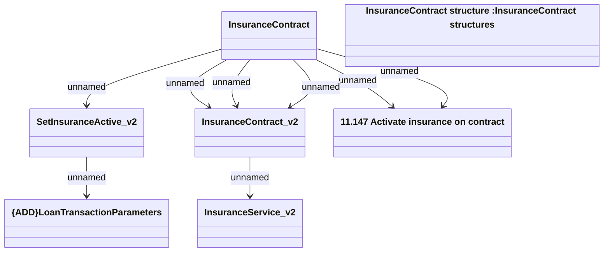

# Insurance Contract - Activate Insurance v2

```mermaid
classDiagram
    class InsuranceContract["InsuranceContract"]
    class ADD_LoanTransactionParameters["{ADD}LoanTransactionParameters"]
    class InsuranceContract_v2["InsuranceContract_v2"]
    class InsuranceService_v2["InsuranceService_v2"]
    class SetInsuranceActive_v2["SetInsuranceActive_v2"]
    class InsuranceContract_structure_InsuranceContract_structures["InsuranceContract structure :InsuranceContract structures"]
    class n_11_147_Activate_insurance_on_contract["11.147 Activate insurance on contract"]
    InsuranceContract --> n_11_147_Activate_insurance_on_contract : unnamed
    InsuranceContract --> n_11_147_Activate_insurance_on_contract : unnamed
    InsuranceContract --> SetInsuranceActive_v2 : unnamed
    InsuranceContract_v2 --> InsuranceService_v2 : unnamed
    InsuranceContract --> InsuranceContract_v2 : unnamed
    InsuranceContract --> InsuranceContract_v2 : unnamed
    InsuranceContract --> InsuranceContract_v2 : unnamed
    SetInsuranceActive_v2 --> ADD_LoanTransactionParameters : unnamed
```
