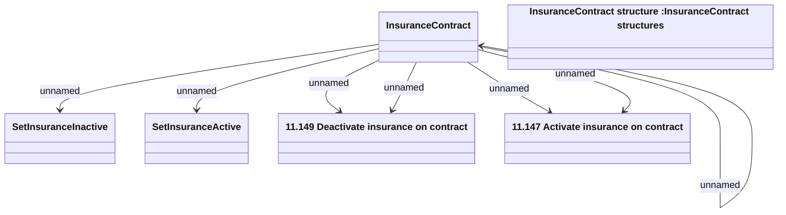

# Insurance Contract - Activate and Deactivate Insurance

```mermaid
classDiagram
    class InsuranceContract["InsuranceContract"]
    class InsuranceContract_structure_InsuranceContract_structures["InsuranceContract structure :InsuranceContract structures"]
    class SetInsuranceInactive["SetInsuranceInactive"]
    class InsuranceContract["InsuranceContract"]
    class SetInsuranceActive["SetInsuranceActive"]
    class n_11_149_Deactivate_insurance_on_contract["11.149 Deactivate insurance on contract"]
    class n_11_147_Activate_insurance_on_contract["11.147 Activate insurance on contract"]
    InsuranceContract --> n_11_147_Activate_insurance_on_contract : unnamed
    InsuranceContract --> n_11_147_Activate_insurance_on_contract : unnamed
    InsuranceContract --> n_11_149_Deactivate_insurance_on_contract : unnamed
    InsuranceContract --> n_11_149_Deactivate_insurance_on_contract : unnamed
    InsuranceContract --> SetInsuranceActive : unnamed
    InsuranceContract --> InsuranceContract : unnamed
    InsuranceContract --> SetInsuranceInactive : unnamed
```
