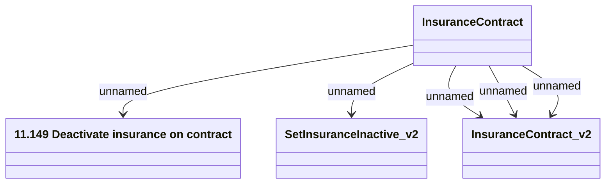

# Insurance Contract - Deactivate Insurance v2

```mermaid
classDiagram
    class InsuranceContract_v2["InsuranceContract_v2"]
    class SetInsuranceInactive_v2["SetInsuranceInactive_v2"]
    class n_11_149_Deactivate_insurance_on_contract["11.149 Deactivate insurance on contract"]
    class InsuranceContract["InsuranceContract"]
    InsuranceContract --> n_11_149_Deactivate_insurance_on_contract : unnamed
    InsuranceContract --> SetInsuranceInactive_v2 : unnamed
    InsuranceContract --> InsuranceContract_v2 : unnamed
    InsuranceContract --> InsuranceContract_v2 : unnamed
    InsuranceContract --> InsuranceContract_v2 : unnamed
```
