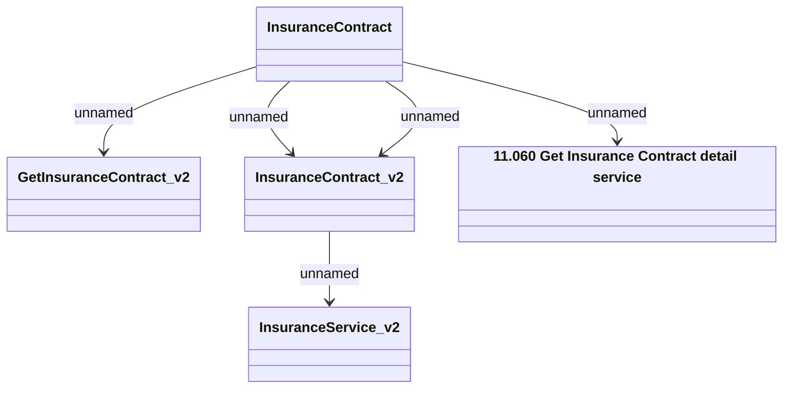

# Insurance Contract - Get Insurance Contract data v2

```mermaid
classDiagram
    class GetInsuranceContract_v2["GetInsuranceContract_v2"]
    class InsuranceService_v2["InsuranceService_v2"]
    class InsuranceContract_v2["InsuranceContract_v2"]
    class n_11_060_Get_Insurance_Contract_detail_service["11.060 Get Insurance Contract detail service"]
    class InsuranceContract["InsuranceContract"]
    InsuranceContract --> n_11_060_Get_Insurance_Contract_detail_service : unnamed
    InsuranceContract --> InsuranceContract_v2 : unnamed
    InsuranceContract --> InsuranceContract_v2 : unnamed
    InsuranceContract_v2 --> InsuranceService_v2 : unnamed
    InsuranceContract --> GetInsuranceContract_v2 : unnamed
```
