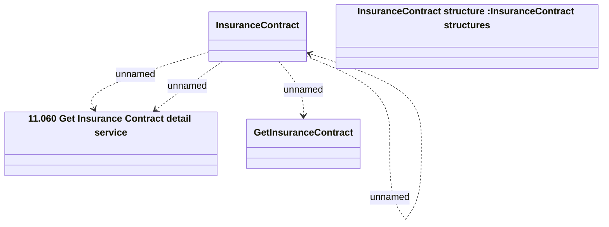

# Insurance Contract - Get Insurance Contract data

- **Diagram Type**: Logical
- **Package**: HomerSelect/BSL/Analysis Model/Insurance/Insurance Contract/REL Insurance features/Changing Insurance operation status/Interface Provided/Insurance Contract Services
- **Diagram ID**: 162066
- **Elements**: 5
- **Connectors**: 4

