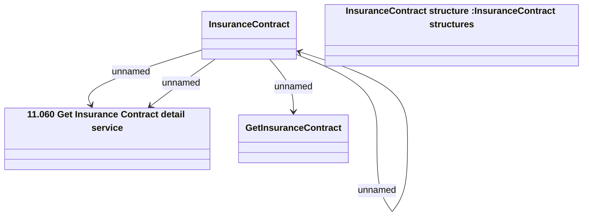

# Insurance Contract - Get Insurance Contract data

```mermaid
classDiagram
    class InsuranceContract["InsuranceContract"]
    class n_11_060_Get_Insurance_Contract_detail_service["11.060 Get Insurance Contract detail service"]
    class InsuranceContract_structure_InsuranceContract_structures["InsuranceContract structure :InsuranceContract structures"]
    class InsuranceContract["InsuranceContract"]
    class GetInsuranceContract["GetInsuranceContract"]
    InsuranceContract --> GetInsuranceContract : unnamed
    InsuranceContract --> InsuranceContract : unnamed
    InsuranceContract --> n_11_060_Get_Insurance_Contract_detail_service : unnamed
    InsuranceContract --> n_11_060_Get_Insurance_Contract_detail_service : unnamed
```
