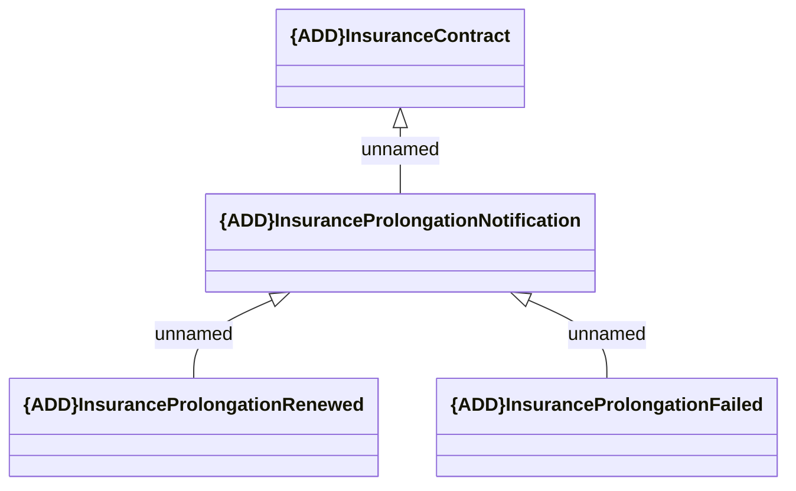

# Insurance Contract prolongation

- **Diagram Type**: Logical
- **Package**: HomerSelect/BSL/Analysis Model/Insurance/Insurance Contract/REL Insurance features/Changing Insurance operation status/Interface Provided/Generated Messages/Insurance Contract notifications
- **Diagram ID**: 161988
- **Elements**: 4
- **Connectors**: 3

