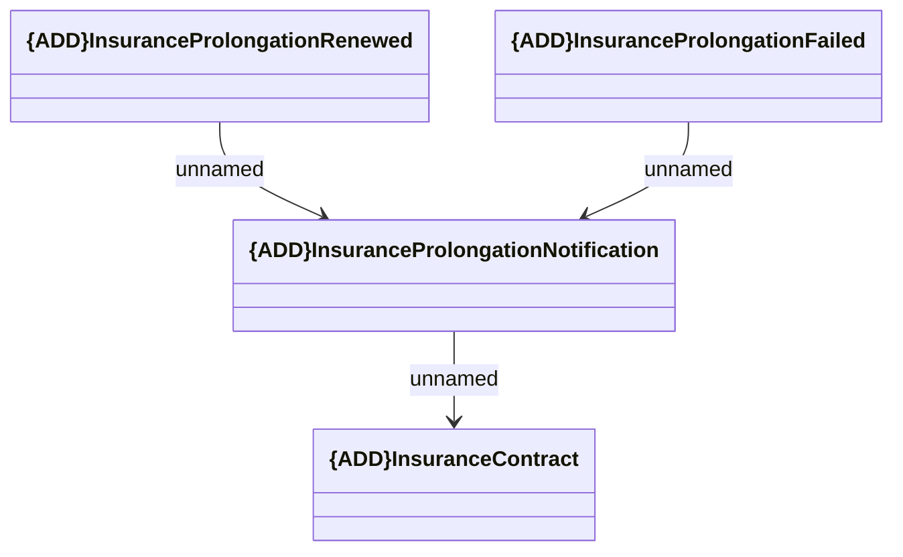

# Insurance Contract prolongation

```mermaid
classDiagram
    class ADD_InsuranceProlongationNotification["{ADD}InsuranceProlongationNotification"]
    class ADD_InsuranceProlongationRenewed["{ADD}InsuranceProlongationRenewed"]
    class ADD_InsuranceProlongationFailed["{ADD}InsuranceProlongationFailed"]
    class ADD_InsuranceContract["{ADD}InsuranceContract"]
    ADD_InsuranceProlongationNotification --> ADD_InsuranceContract : unnamed
    ADD_InsuranceProlongationRenewed --> ADD_InsuranceProlongationNotification : unnamed
    ADD_InsuranceProlongationFailed --> ADD_InsuranceProlongationNotification : unnamed
```
