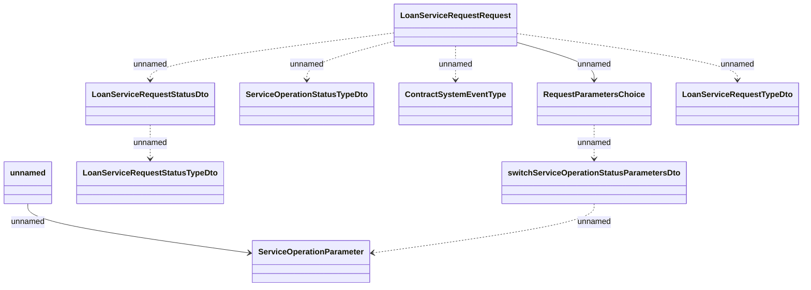

# Insurance change notifications

- **Diagram Type**: Logical
- **Package**: HomerSelect/BSL/Analysis Model/Insurance/Insurance Contract/REL Insurance features/Changing Insurance operation status/Interface Provided/Generated Messages/Insurance change notifications
- **Diagram ID**: 161987
- **Elements**: 10
- **Connectors**: 9

