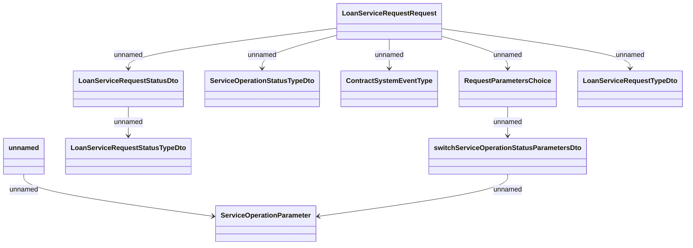

# Insurance change notifications

```mermaid
classDiagram
    class ServiceOperationParameter["ServiceOperationParameter"]
    class switchServiceOperationStatusParametersDto["switchServiceOperationStatusParametersDto"]
    class RequestParametersChoice["RequestParametersChoice"]
    class ServiceOperationStatusTypeDto["ServiceOperationStatusTypeDto"]
    class ContractSystemEventType["ContractSystemEventType"]
    class LoanServiceRequestStatusDto["LoanServiceRequestStatusDto"]
    class LoanServiceRequestStatusTypeDto["LoanServiceRequestStatusTypeDto"]
    class LoanServiceRequestTypeDto["LoanServiceRequestTypeDto"]
    class LoanServiceRequestRequest["LoanServiceRequestRequest"]
    LoanServiceRequestRequest --> LoanServiceRequestTypeDto : unnamed
    LoanServiceRequestStatusDto --> LoanServiceRequestStatusTypeDto : unnamed
    LoanServiceRequestRequest --> LoanServiceRequestStatusDto : unnamed
    LoanServiceRequestRequest --> ContractSystemEventType : unnamed
    LoanServiceRequestRequest --> ServiceOperationStatusTypeDto : unnamed
    LoanServiceRequestRequest --> RequestParametersChoice : unnamed
    RequestParametersChoice --> switchServiceOperationStatusParametersDto : unnamed
    unnamed --> ServiceOperationParameter : unnamed
    switchServiceOperationStatusParametersDto --> ServiceOperationParameter : unnamed
```
