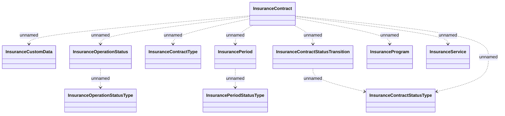

# InsuranceContract structures

- **Diagram Type**: Logical
- **Package**: HomerSelect/BSL/Analysis Model/Insurance/Insurance Contract/REL Insurance features/Changing Insurance operation status/Interface Provided/Insurance Contract Services/Schema definitions
- **Diagram ID**: 162075
- **Elements**: 11
- **Connectors**: 11

