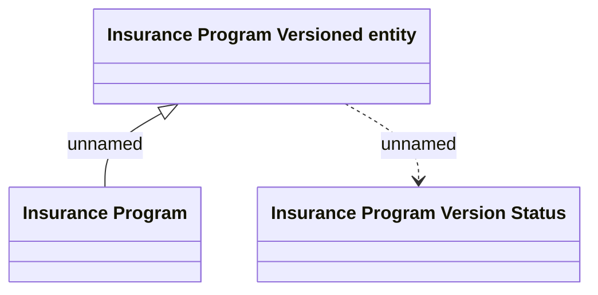

# Insurance Program Versioned Entity

- **Diagram Type**: Logical
- **Package**: HomerSelect/BSL/Analysis Model/Insurance/Insurance Program - old BSL/Insurance program Root/Logical Data Model
- **Diagram ID**: 125712
- **Elements**: 3
- **Connectors**: 2

