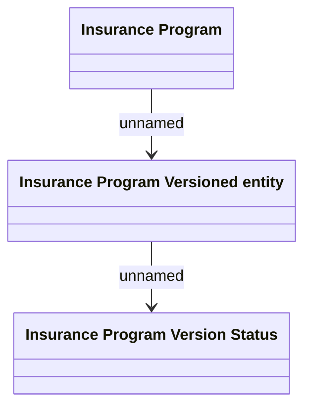

# Insurance Program Versioned Entity

```mermaid
classDiagram
    class Insurance_Program["Insurance Program"]
    class Insurance_Program_Version_Status["Insurance Program Version Status"]
    class Insurance_Program_Versioned_entity["Insurance Program Versioned entity"]
    Insurance_Program --> Insurance_Program_Versioned_entity : unnamed
    Insurance_Program_Versioned_entity --> Insurance_Program_Version_Status : unnamed
```
